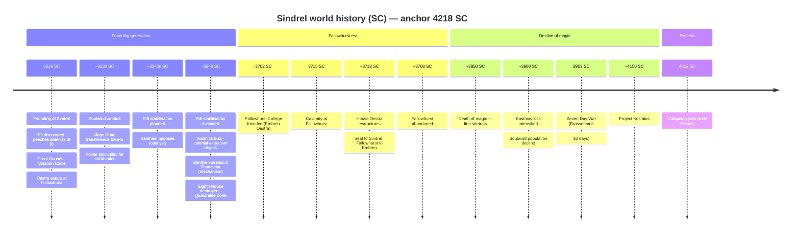

```mermaid
timeline
    title Sindrel world history (SC) — anchor 4218 SC

    section Founding generation
        3218 SC : Founding of Sindrel
                : Rift discovered · peaches eaten (7 of 8)
                : Great Houses · Octarion Circle
                : Oestra estate at Fallowhurst
        ~3230 SC : Soulwind conduit
                 : Mage Road transference towers
                 : Power stockpiled for stabilisation
        ~3240s SC : Rift stabilisation planned
                  : Samhain opposes (catalyst)
        ~3248 SC : Rift stabilisation executed
                 : Kosmios bias · colonial extraction begins
                 : Samhain sealed in Thanismot (mechanism)
                 : Eighth House destroyed · Quarantine Zone

    section Fallowhurst era
        3702 SC : Fallowhurst College founded (Embren Oestra)
        3715 SC : Calamity at Fallowhurst
        ~3718 SC : House Oestra restructures
                 : Seat to Sindrel · Fallowhurst to Embren
        ~3768 SC : Fallowhurst abandoned

    section Decline of magic
        ~3850 SC : Death of magic — first stirrings
        ~3900 SC : Kosmios lock intensified
                 : Soulwind population decline
        3953 SC : Seven Day War (Brassmeade: 10 days)
        ~4150 SC : Project Kosmios

    section Present
        4218 SC : Campaign year (31st Enean)

```